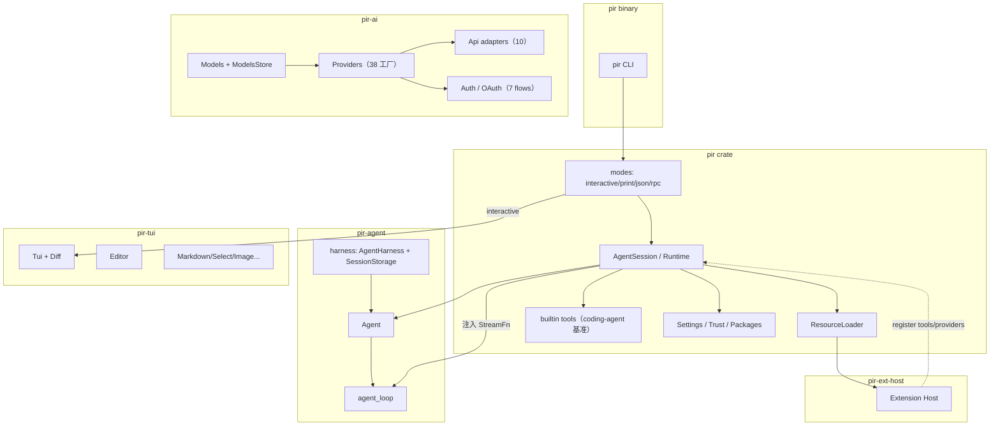
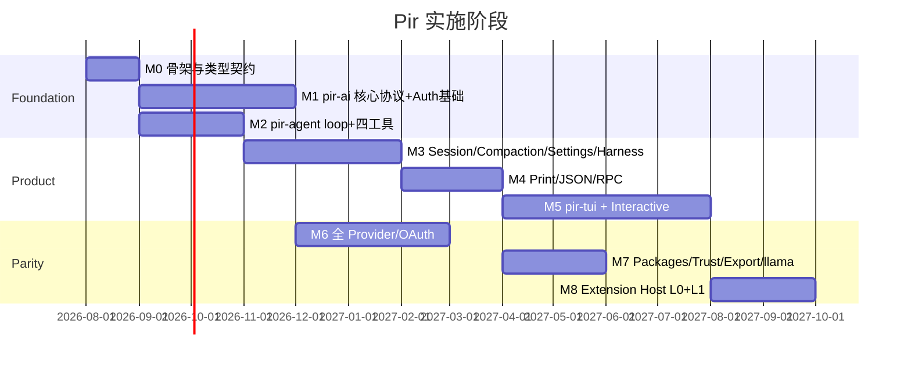

# Pir 架构设计文档

> 目标：用 Rust workspace **同构复刻** Pi agent harness。
> 对照版本：`external/pi` @ v0.82.1（`2efa728`）
> 配套：[`00-feasibility.md`](./00-feasibility.md)、[`01-requirements.md`](./01-requirements.md)
> 范围决策：[ADR-0003](./adr/0003-coverage-review-scope-decisions.md)（harness 完整移植；工具以 coding-agent 为基准；不做启动迁移与 pi-ai CLI）

---

## 1. 设计原则

1. **包边界同构**：四个核心 crate 对应 Pi 四包，依赖单向。
2. **错误进流不进 panic**：provider/stream 失败 → 事件 + `stopReason`，与 Pi 一致（stream 不抛出契约）；能力层（fs/shell 抽象）错误走结构化 Result，不 panic。
3. **应用消息 ≠ LLM 消息**：`AgentMessage` 可扩展；仅在 `convert_to_llm` 边界收窄。
4. **行为金标准**：`external/pi` **钉死 commit 的代码**（非其设计文档——harness 层自述仍在硬化中）；禁止「自以为合理」的语义漂移。上游文档与代码冲突时以代码为准（已发现案例：`/skill:name` 参数追加格式）。
5. **扩展解耦**：核心只依赖 `ExtensionHost` trait；实现为 **Rust + Wasm**（不做 JS 宿主）。见 [ADR-0001](./adr/0001-extension-and-config-dir.md)。
6. **TUI 必达**：可并行先打通 headless/RPC 作对拍，但完整版本必须含 Interactive TUI（[ADR-0002](./adr/0002-baseline-decisions.md)）。
7. **配置根目录**：全局 `~/.pir/agent`，项目 `.pir`（不读 `~/.pi`，不做迁移）。
8. **上游钉死**：`external/pi` @ `2efa728` / 0.82.1（见 [`UPSTREAM.md`](../UPSTREAM.md)）。
9. **工具行为基准**：内置工具以 **coding-agent 实现**为对拍基准（ADR-0003 §2）；harness 自带工具工厂作为 `pir-agent` 可选层存在。

---

## 2. Workspace 结构

```
pir/
├── Cargo.toml                 # workspace
├── crates/
│   ├── pir-ai/                # ↔ @earendil-works/pi-ai（纯库，无 bin；ADR-0003 §4）
│   ├── pir-agent/             # ↔ @earendil-works/pi-agent-core（含 harness 层）
│   ├── pir-tui/               # ↔ @earendil-works/pi-tui
│   ├── pir/                   # ↔ @earendil-works/pi-coding-agent（bin + lib SDK）
│   ├── pir-ext-host/          # Rust + Wasm 扩展宿主（无 JS）
│   └── pir-test-support/      # faux provider、黄金 JSONL、VT 助手
├── docs/
├── external/pi/               # 上游只读对照（git submodule）
└── fixtures/                  # 从 Pi 导出的 session / RPC 样例
```

**范围排除**（ADR-0003 §其他 / 需求 §15）：`packages/server`、`packages/evals`、`coding-agent/src/bun`、`storage/sqlite-node` 不复刻；`packages/evals/pi-harness.ts` 可作为对拍 harness 参考。

### 2.1 依赖图



---

## 3. `pir-ai` 设计

### 3.1 职责

统一多协议 LLM 访问：类型、流式事件、工具 schema 校验、用量/成本、模型目录、鉴权、跨 provider 消息变换、重试与 overflow 判定。**纯库 crate，无 bin**（不复刻 pi-ai 包级 CLI，ADR-0003 §4）。

### 3.2 核心类型（镜像 Pi）

```rust
// 示意
pub enum Role { User, Assistant, ToolResult, /* app roles live in pir-agent */ }

pub struct Context {
    pub system_prompt: Option<String>,
    pub messages: Vec<Message>,
    pub tools: Vec<Tool>,
}

pub struct Model {
    pub id: String,
    pub provider: String,
    pub api: ApiKind,
    pub context_window: u32,
    // pricing（含 cost.tiers 阶梯）、thinkingLevelMap 三态、vision、headers、compat、...
}

pub enum StreamEvent {
    Start { partial: AssistantMessage },
    TextStart { content_index: usize }, TextDelta { content_index: usize, delta: String }, TextEnd { content_index: usize },
    ThinkingStart { .. }, ThinkingDelta { .. }, ThinkingEnd { .. },
    ToolCallStart { .. }, ToolCallDelta { .. }, ToolCallEnd { .. },
    Done { message: AssistantMessage },
    Error { .. },
}
// 契约：不同 content block 的事件可交错，消费者按 content_index 关联；
// stream 调用后一切失败走 Error 事件 + stopReason，不返回 Err。
```

`StreamOptions` 全量：`temperature / max_tokens / signal / api_key / transport / cache_retention / session_id / on_payload / on_response / headers / timeout_ms / websocket_connect_timeout_ms / max_retries / max_retry_delay_ms(60s) / metadata / env`。

关键字段契约：`AssistantMessage{api,provider,model,responseModel?,responseId?,diagnostics?,usage,stop_reason,error_message,timestamp}`；`Usage{cacheWrite1h?,reasoning?,totalTokens,cost{}}`；`ToolCall.thought_signature?`；`TextContent.text_signature?`；`ThinkingContent.thinking_signature?/redacted?`；`Tool.constrained_sampling`（json_schema strict prefer/require | grammar lark/regex）。

> 表征适配（D-002，T01 已锁定）：`Api` 开放联合 → `ApiKind(String)` newtype + 已知常量；`Model.compat` 条件类型 → 平铺 `ModelCompat`（4 套 compat 接口合并，重名字段类型上游一致，线格式两方向兼容）；消息 `role` 字面值标签由单变体标记枚举承载，保证各消息 struct 独立序列化时自带 `role`。

### 3.3 Api 适配层

```
pir-ai/src/api/
  openai_completions.rs        # 含 compat URL 自动检测矩阵（detect_compat）
  openai_responses.rs          # + openai_responses_shared.rs
  azure_openai_responses.rs
  openai_codex_responses.rs    # WebSocket 子系统 + zstd SSE + JWT accountId
  anthropic_messages.rs        # Claude Code 伪装 + 工具名大小写映射 + 自适应/预算 thinking 双轨
  google_generative_ai.rs      # + google_shared.rs
  google_vertex.rs
  bedrock_converse_stream.rs   # 手写 SigV4 + event-stream 解码（§14）
  mistral_conversations.rs
  pi_messages.rs
```

每个适配器实现（D-004，T03 已落地）：

```rust
pub trait ProviderStreams: Send + Sync {
    fn stream(&self, model: &Model, ctx: &Context, opts: Option<StreamOptions>) -> AssistantMessageEventStream;
    fn stream_simple(&self, model: &Model, ctx: &Context, opts: Option<SimpleStreamOptions>) -> AssistantMessageEventStream;
}
```

同步方法直接返回推送式事件流句柄（对齐上游 `StreamFunction` 形状；错误编码为事件，不返回 Err）。T03 已交付 `anthropic_messages.rs` / `openai_completions.rs`（含 `detect_compat` 表驱动矩阵）/ `openai_responses.rs` + `openai_responses_shared.rs`；清单中其余适配器随 T13 落地。HTTP 层为 reqwest 直连 + 自写 `SseDecoder`，不经过官方 SDK，逐项可观测差异见 D-005（SDK 头/默认超时缺失、严格 SSE 解析文案、`metadata.raw` 取自 HTTP body 等）。

`Models::stream` / `stream_simple` 按 `model.api` 分发（混合 API provider 的 api map 分发，缺 API 时报 stream error）；thinking 在 `stream_simple` 层统一映射（clamp、预算默认表、xhigh/max 预算路径降为 high）；`clamp_max_tokens_to_context`（4096 安全余量，下限 1）。

各适配器行为锚点见需求 §5.2，逐条移植：**compat 检测矩阵**（openai-completions 行为正确性核心）、Anthropic OAuth 伪装与工具名映射、Codex WS 连接缓存/SSE 回退/zstd/accountId、Google 模型族 thinking 分流、Mistral id 归一化、Bedrock region 解析与 header 白名单、Azure 归一化、pi-messages rewrite 诊断。

**来源空白（Google/Bedrock）**：上游 google-generative-ai 与 google-vertex 适配器委托 `@google/genai` SDK，Bedrock 委托 `@aws-sdk/client-bedrock-runtime` + `@smithy`——基址模板、SSE 帧格式、SigV4、event-stream 解码等传输层细节在 TS 源码中不可考。Rust 实现须从 SDK 行为与 AWS 规范反推，对拍只能基于可观测流量与 SDK 文档；§14 的「手写 SigV4 + reqwest + 自实现 event-stream 解码」决策即源于此。

### 3.4 Provider 层

- `Provider` trait：模型列表、默认 base URL、auth 解析、`filter_models?`、`refresh_models?`、stream/streamSimple
- 38 个内置工厂（需求 §5.3 清单）；`create_provider` 支持单 API 或按 `model.api` 分发的混合 map；动态 overlay 与 baseline 按 id 合并；`inflight_refresh` 去重
- 模型目录为**生成物**：`build.rs` 从 models.dev 数据生成内置 catalog（对齐 `generate-models.ts` 的修正规则：定价、能力位、Kimi 零价、strict 能力等；T03 已落 `build.rs` 占位与 `generated.rs` include 机制，空 catalog，正式数据管线在 T13/T14）；`pir update --models` 远程 overlay（ETag/4h 新鲜度/generatedAt 比对，对齐 coding-agent `remote-catalog-provider.ts`）；`ModelsStore` 持久化（models/lastModified/checkedAt/etag，T03 已交付内存与 JSON 文件两实现）+ `refresh({allow_network:false})` 离线恢复。用户 `models.json` 加载移植自 coding-agent `model-config.ts`，落 `pir-ai/src/models_json.rs`（JSONC stripJsonComments、serde+手工校验 pass，措辞差异见 D-006）
- 应用可按需只注册子集（feature flags 等价 tree-shake）

### 3.5 Auth

```
CredentialStore (JSON file, 0600)
  ├─ api_key entries（含 env 字段，key 值解析 DSL：!cmd / $VAR / $$ 转义）
  └─ oauth tokens (refresh)

resolve_auth(provider, model) 顺序：
  显式 apiKey → credential store（命中即停）→ ambient（env/AWS profile/ADC）
  OAuth 过期 → modify 锁内双重检查刷新；失败抛错，绝不回退 env key

OAuth flows (7)：anthropic / openai-codex / github-copilot(device) /
  openrouter(永久 key) / kimi-coding / xai / radius
```

- `modify` 是唯一写路径：按 provider 串行化 read-modify-write + 跨进程文件锁（`fs2`）
- OAuth 流程用 `oauth2` crate；一次性 localhost 回调页用 `axum`（已决策，§14）；device 轮询 RFC 8628 参数对齐（5s/slow_down/1s 下限/WSL 时钟漂移文案）
- 交互协议：`AuthInteraction` trait（prompt: text/secret/select/manual_code，per-prompt signal 竞速取消；notify: links/auth_url/device_code/progress）——各模式提供实现（TUI 对话框 / RPC 协议 / print 报错）
- `options.env` 每请求环境覆盖；代理变量（`HTTP_PROXY/HTTPS_PROXY/no_proxy`）解析
- Rust 落地注记（T04）：文件锁 fs2 无 stale/onCompromised 对应物、`!cmd` 仅 unix `/bin/sh -c`、快照用 `serde_json::Map` 保序做字节对拍、device code 时钟抽象与 OAuth 测试缝等实现差异——见偏离 D-008 / D-009

### 3.6 横切模块

```
pir-ai/src/utils/
  transform_messages.rs   # handoff：孤儿 tool call 合成、error/aborted 不回放、
                          # 图片占位符、thinking 跨模型转文本、id 归一化回填
  retry.rs                # 外层 retryAssistantCall + 错误分类 regex 表
  provider_retry.rs       # SDK 镜像层：x-should-retry、retry-after（retry-after-ms→retry-after 秒→HTTP-date 优先级链）、60s 上限立即失败
  overflow.rs             # 三分支 isContextOverflow（pattern 表 / silent / 截断式）
  estimate.rs             # chars/4、image=4800、usage 锚点 trailing 估算
  json_parse.rs           # 流式 partial JSON + repair
  validation.rs           # 工具参数 schema 校验（jsonschema 单路径 + 宽松类型强转；措辞 ≠ TypeBox，D-006）
  sanitize_unicode.rs     # 去孤立 surrogate（Rust String 无孤代理，恒等实现，D-007）
  error_body.rs           # 各 SDK 错误形状归一化，body 截 4000
  deferred_tools.rs       # addedToolNames / splitDeferredTools
  event_stream.rs         # AssistantMessageEventStream（推送式事件流，result() 屏障）
  headers.rs              # header 大小写不敏感合并、null 删除、reqwest HeaderMap 转换
  hash.rs                 # shortHash（id 归一化回填用）
  session_resources.rs    # Codex WS 等 per-session 资源清理
  cost.rs                 # calculateCost：tiers 阶梯（tier 口径 input+cacheRead+cacheWrite 取最高阈值，request-wide）+ cacheWrite1h 按 2× input 硬编码 + service tier 乘数
```

图像子系统独立：`ImagesModels` / `ImagesProvider`（OpenRouter images，chat completions `modalities` 非流式，永不 reject）。

### 3.7 Faux provider

脚本化响应队列 + 响应工厂 + `tokensPerSecond` + usage 4 字符/token 估算 + cache 模拟（sessionId 且 cacheRetention≠none）+ `state.callCount`；队列空固定错误文案。对拍基建的核心（§10）。

实现位于 `pir-test-support/src/faux.rs`（T02）。为可重复性做了确定性化（偏离 D-003）：delta 切块 min..=max 循环替代 `Math.random`、默认 id 用线程局部计数器、默认 timestamp=0、响应工厂为同步闭包；usage 估算按 chars/4（BMP 与上游 UTF-16/4 等价）。这些只影响测试基建内部，delta 边界不入对拍契约（fixtures 锚点粒度见 `fixtures/README.md` §2）。

---

## 4. `pir-agent` 设计

### 4.1 分层

| 模块 | 对应 Pi | 说明 |
|------|---------|------|
| `agent_loop` | `agent-loop.ts` | 无状态循环，emit 事件；observational EventStream（无屏障） |
| `agent` | `agent.ts` | 状态、全事件订阅屏障、队列、互斥 run |
| `types` | `types.ts` | AgentEvent / AgentTool / AgentMessage（含扩展消息文本格式常量；D-002：声明合并折叠进 `messages.rs`，AgentTool 为 `async_trait`） |
| `session` | `session-manager.ts`（条目类型）+ `harness/types.ts`（SessionTreeEntry） | session 条目 serde 类型单一来源（D-001，T01 落地）；行为逻辑仍在 T07（pir）/ T16（harness） |
| `harness` | `harness/*` | **完整移植**（ADR-0003 §1）：AgentHarness、SessionStorage/Repo 抽象、JSONL+InMemory、compaction/branch-summary/skills/prompt-templates/默认工具工厂、`stream_proxy` |

`pir`（coding-agent 对应 crate）**不使用** harness——它有自己的 AgentSession/SessionManager/tools（与 Pi 一致）；harness 作为 `pir-agent` 的公共可选层，供 SDK 嵌入方与对拍使用。harness 与 coding-agent 实现的行为差异以 coding-agent 为对拍基准。

### 4.2 `agent_loop` 伪代码

```text
emit agent_start
emit turn_start (+ prompt message_start/end)   # 首个 turn 不重复 turn_start
poll steering（run 启动时一次）
loop:  # 外层（follow-up）
  loop until no toolCalls and no pending steering:  # 内层
    inject pending steering（message_start/end 先行）
    assistant = stream_assistant(transform → convert_to_llm → get_api_key → stream_fn)
    if stopReason in {error, aborted}: emit turn_end([]) + agent_end; return
    if stopReason == length: 整批 toolCalls 产固定文案错误 toolResult，不执行
    if toolCalls:
      preflight（顺序：find → prepareArguments shim → 校验 → before_tool_call → abort 检查）
      execute parallel|sequential（batch 内任一 sequential → 整批顺序）
      emit tool_execution_*（end 按完成序）与 toolResult messages（按源序）
      emit turn_end
      if all terminate: hasMoreToolCalls=false → 内层 while 退出   # runtime-only，不落盘
      # terminate 不提前退出：以下 prepareNextTurn / shouldStopAfterTurn / steering 轮询 / follow-up 检查照常执行，最终统一 emit agent_end
      prepareNextTurn(context/model/thinkingLevel 可整体替换)
      if shouldStopAfterTurn: agent_end; return
      poll steering → emit turn_start
    else:
      emit turn_end; break inner
  deliver follow-ups if any → continue outer
emit agent_end
```

异常路径：loop 抛错 → `handleRunFailure` 合成 failure assistant 消息（stopReason=aborted|error）+ 补发完整事件序列（在 `Agent` 层）。

### 4.3 并发模型（Rust）

- 运行时：`tokio`
- 事件：每个 listener 一个独立的 `tokio::sync::mpsc` channel（不用 `broadcast`——其 Lagged 语义与 Pi 的背压模型不符）；`Agent::subscribe` 对**每个事件**先 reduce 内部状态再按注册顺序 `await` 全部 listener（全事件屏障）；`agent_end` settle 前 `isStreaming` 保持 true
- 低层 `agent_loop` 返回 observational `EventStream`（不等异步消费）——两层语义必须区分
- 工具 parallel：`JoinSet` + 完成通道；结果按 toolCall 源序组装；`tool_execution_update` 在 execute settle 后忽略、已排队的返回前 await
- 取消：`CancellationToken` 贯穿 stream 与 bash（preflight 多检查点，错误文案 `"Operation aborted"`）

### 4.4 StreamFn 注入

```rust
pub type StreamFn = Arc<dyn Fn(Model, Context, StreamOptions) -> BoxStream<'static, StreamEvent> + Send + Sync>;
```

Agent **不**依赖具体 provider，便于测试 faux 与 proxy。StreamFn 不得 panic（对齐「不得 throw」契约）。

> Rust 落地注记（D-010，T05 验收）：hook 的 args 回传与错误降级经返回值通道表达（`BeforeToolCallResult.args`、`AfterToolCallFn -> Result<..>`）；`BoxStream` 无 result 通道，流无终止事件时合成 error 消息收尾；reasoning/thinking_budgets 保留在 `AgentLoopConfig` 由组装层绑定；listener 屏障为 in-process 按注册序串行 await；`continue()` 命名 `continue_run`。详见 `docs/plan/v0.1/deviations/D-010-agent-loop-rust-notes.md`。
>
> Rust 落地注记（D-013，T08 验收）：`StreamOptions` 增加 `reasoning: Option<ModelThinkingLevel>` 字段——上游 summary 调用经 `SimpleStreamOptions.reasoning` 传 thinking level，而 pir-agent 的 summary 生成直接走本节的 `StreamFn`（裸 `StreamOptions`），reasoning 通道因此落在 `StreamOptions` 上；默认 `None`，既有路径行为不变。

### 4.5 Harness 层设计要点

- `AgentHarness`：phase 状态机（idle/turn/compaction/branch_summary/retry）；turn snapshot vs config 分离；三队列（steer/followUp/nextTurn）；22 种事件与 hook 结果映射（需求 §4.4）；双订阅模型——`subscribe` 纯观察（支持 `*` 通配），`on` 为带返回值 hook（多 handler 顺序执行、最后非 `undefined` 胜出；patch 型 hook 依次归约）；`entryTransforms`/`entryProjectors` 扩展点（写入/读出两侧变换）；session 树为 leaf 追加 + 重放重建语义
- **持久化屏障**：`message_end` 先写 session 再发事件；busy 期间写入进 `pending_session_writes`；`turn_end` flush 后 `save_point`；`agent_end` flush + `settled`——决定 JSONL 行序。屏障写入在 loop 事件回调内 `await`，失败路径：持久化失败使 loop reject → `emitRunFailure` 合成失败消息并重放完整事件序列（失败消息同样走持久化，二次失败聚合为 `AgentHarnessError`）；`executeTurn` 末尾 finally flush 失败则直接抛出，不经 `emitRunFailure`
- `SessionStorage`/`SessionRepo` trait + `JsonlSessionStorage`（header version: 3，entry id=uuidv7 后 8 位碰撞重试；支持 `firstKeptEntryId` 与 **`retainedTail`** 两形态 + `active_tools_change`/`leaf` 条目）+ `InMemory*`；SQLite 不做（trait 同构预留）
- compaction/branch-summary/skills/prompt-templates/默认工具工厂：与 coding-agent 对应模块**共享算法常量**（token 估算、prompt 模板、截断常数），实现上抽到 `pir-agent` 公共模块供两处复用，行为差异以 coding-agent 为准记录
- `stream_proxy`：SSE 客户端协议（POST `/api/stream`，服务端剥离 partial、客户端 `parseStreamingJson` 重建）；12 种事件类型：`start, text_start, text_delta, text_end, thinking_start, thinking_delta, thinking_end, toolcall_start, toolcall_delta, toolcall_end, done, error`

---

## 5. `pir-tui` 设计

### 5.1 为何不直接用 ratatui

Pi 的交互契约建立在「ANSI 行列表 + 自定义差分 + Overlay + Kitty 输入」上。ratatui 的 widget/layout 模型不同，强行适配会导致行为无法 1:1。
**策略**：移植 pi-tui 算法；仅用 `crossterm`（或纯 termios）做 raw mode / 读写。

### 5.2 核心抽象

```rust
pub trait Component: Send {
    fn render(&self, width: usize) -> Vec<String>; // ANSI 行，行宽硬约束
    fn invalidate(&mut self) {}                     // 主题失效重建
}

pub trait Focusable: Component {
    fn handle_input(&mut self, raw: &str);
    fn focused(&self) -> bool;
    fn wants_key_release(&self) -> bool { false }
}

pub struct Tui { /* children, overlays, focus, previous_lines, viewport, terminal */ }
```

### 5.3 渲染

1. CSI 2026 包裹（`?2026h`/`?2026l`）
2. 首次全量（不清屏）/ 全量清屏（`\x1b[2J\x1b[H\x1b[3J`）/ 行差分（append 快路径、纯删除快路径、无变化只移硬件光标）
3. **全量回退条件**：宽度变化、高度变化（Termux 例外）、clearOnShrink 收缩、`first_changed < prev_viewport_top`、删除行数超终端高度、`request_render(force)`
4. 节流 16ms
5. 行尾 SGR + OSC 8 reset
6. Kitty 图像行范围 expand + delete
7. 调试通道：`PIR_DEBUG_REDRAW`（记录全量重绘原因）、`PIR_TUI_WRITE_LOG`

### 5.4 输入

`StdinBuffer`（CSI/OSC/DCS/APC/鼠标跨 chunk 重组 + bracketed paste 缓冲）→ 键位解析（Kitty flags=7 含 **key release/repeat** + legacy 全表；DA 探测无应答立即回退 modifyOtherKeys）→ 全局 listener → focused component；退出前 `drain_input()`。

`KeybindingsManager` 读 JSON，映射到 editor/action 枚举（与 Pi token 名一致，含旧键名迁移表 60+ 项，便于配置互通）。**键位判断永不硬编码**（例外：shift+ctrl+d = /debug）。

### 5.5 组件移植清单（12 个，全量）

1. Terminal / Tui / Text / Container / Spacer / TruncatedText
2. SelectList / Input / Editor（undo-stack、kill-ring、历史、paste marker、autocomplete）
3. Markdown（marked 等价 + `trim_partial_closing_fences`）/ Loader / CancellableLoader / Box
4. Image（Kitty + iTerm2 + 能力检测矩阵）/ SettingsList
5. Utils：grapheme 宽度（`unicode-width` + ANSI 感知包装）

coding-agent 侧 40 个交互组件在 `pir` crate 的 interactive mode 内实现（需求 §8.6 清单）。

---

## 6. `pir`（coding-agent）设计

### 6.1 启动管线

```text
parse args（手写解析器，与上游 args.ts 同构——非 clap：-p 值吞噬、未知
  --flag 收集为扩展标志、互斥诊断矩阵 clap 无法表达，D-015）
  → resolve agent_dir / cwd / offline（--offline 同时设 PIR_SKIP_VERSION_CHECK）
  → SettingsManager (global, projectTrusted=false) + http proxy
  → 子命令分流（package/config，先于主 parseArgs）
  → resolve app mode: rpc > json > print（-p 或非 TTY）> interactive
  → 标志互斥校验（--fork / --session-id 等）+ diagnostics
  → 首次运行 → first-time setup（主题 + analytics opt-in）
  → SessionManager (file | memory | resume/fork/--session 三级解析)
  → project trust gate（两阶段：先全局+CLI 扩展求决策，trusted 后完整 reload）
  → create_agent_session_services(cwd)
       ResourceLoader: context, skills, prompts, themes, extensions
       ModelRuntime（--models / enabledModels → resolveModelScope）
       Tools
  → create_agent_session_from_services
  → bind extension host
  → dispatch mode: interactive | print | json | rpc
```

与 Pi `main.ts` / `createAgentSessionRuntime` 对齐，保证 `/new`、切 cwd、resume 时 **重建 cwd 绑定服务**。**不实现** Pi migrations.ts 的 legacy 启动迁移（ADR-0003 §3）。

**Rust 落地注记**（T10，D-015）：实现于 `crates/pir/src/app.rs`（main.ts 全管线）+ `main.rs`。差异要点：CLI 解析为 `cli/args.rs` 手写扫描器（`args.test.ts` 84 测试全量移植）；provider-composer / 远程 catalog / 38 内置 provider 工厂为 T13 子集（ModelRuntime 提供 `register_provider` 组合点）；`--resume` 交互 picker / install 等子命令 / `--export` 为 T12/T14 占位（入口可识别并给「未实现」诊断）；system prompt 文档段落的 docs 路径取可执行文件目录探测、缺失整段省略（pir 无 npm 包随捆 docs）；进程标记环境变量 `PIR_CODING_AGENT=true` 在两个 bin 入口设置（对齐 cli.ts/rpc-entry.ts）。详见 `docs/plan/v0.1/deviations/D-015-headless-modes-rust-notes.md`。

### 6.2 `AgentSession`

职责聚合：

- 持有 `Agent`、当前 model、thinking level、messages 视图
- `prompt` / `steer` / `follow_up` / `abort`（+ `_pendingNextTurnMessages` asides）
- compaction（双路触发：agent_end 后 + prompt 提交前；overflow 恢复一次）/ `navigate_tree`
- `execute_bash`（user bash 独立路径，`!!` → excludeFromContext；流式期间挂起、agent_end flush）
- 把 AgentEvent 映射为 `AgentSessionEvent`（扩展事件全集见需求 §2.3）
- 持久化：每次 message_end / tool / model_change 等 append JSONL（延迟落盘：首个 assistant 前不建文件）

### 6.3 `SessionManager`

- 树：`id`（8 hex）、`parentId`、leaf 分支；`getTree` 子节点按 timestamp 排序、孤儿当根
- 加载迁移 v1–v3（含 `firstKeptEntryIndex` → `firstKeptEntryId`、`hookMessage` → `custom`），迁移后整文件重写。**分叉点**：自动迁移仅是主路径 `SessionManager` 行为；harness `JsonlSessionStorage` 硬要求 header version===3、不做迁移，否则抛 `invalid_session`
- `build_context_entries()`：路径上最后一个 compaction 生效（firstKeptEntryId 形态；retainedTail 形态读取兼容，ADR-0003 §1）
- `createBranchedSession`（label 剔除重链）、`forkFrom`（新 header + 全量拷贝 + wx）
- 读取健壮性：1MB 流式读跳畸形行；header 4KB/1MB 扫描上限回退全量
- **无文件锁**（与 Pi 一致；锁仅 auth/settings/trust，用 `fs2`）

**存储**：仅 JSONL。路径默认 `~/.pir/agent/sessions/`（`--<cwd>--` 编码：去前导斜杠，`/\:`→`-`）。格式对齐钉死版 Pi；**不做** `~/.pi` 迁移工具。

**Rust 落地注记**（T07，D-012）：实现于 `crates/pir/src/core/session_manager.rs`（同步 IO，调用方自行 `spawn_blocking`），条目类型单一来源在 `pir-agent::session`（D-001）。差异要点：`retainedTail` 形态读取时按上游 `docs/session-format.md`（self-contained checkpoint）与 harness 行为展开进 context（coding-agent 钉死版不展开；主路径只写 `firstKeptEntryId` 形态，不影响对拍契约）；id/uuidv7 由 `pir-ai/src/utils/uuid.rs` 自实现（不引 `rand`/`uuid` crate）；typed 联合体的固有降级边界（合法 JSON 非对象行丢弃、形状不合法的已知条目降级 Raw、header 发现需完整 typed header、数字格式化 `1e2` 级微差）逐条见 D-012；`list`/`listAll` 已于 T10 提前实现（`--session` 三级解析需要，D-015）。

### 6.4 Compaction

独立模块移植 `compaction.ts` / `branch-summarization.ts` / `utils.ts`：

- token 估算：逐字节移植 Pi `estimateTokens`（chars/4 纯函数启发式；image=4800；toolCall=name+JSON(args)；与 ADR-0002 §4 一致，不允许偏差）
- 切点搜索（倒序累积、绝不切 toolResult、前向吸收元数据）、split turn、四个 summary prompt 模板字节级对齐（便于对拍）：三个 summary 模板 + 所有 summary 调用共用的 system prompt `SUMMARIZATION_SYSTEM_PROMPT`；split-turn 合并格式串 `\n\n---\n\n**Turn Context (split turn):**\n\n` 与占位串 `No prior history.` 同样字节级对齐
- maxTokens 预算（history 0.8× / turn prefix 0.5× / branch 2048）；overflow 三分支 + 同模型守卫 + 一次恢复
- 文件操作跟踪 → `<read-files>`/`<modified-files>` + `details.{readFiles,modifiedFiles}` 累积
- 请求隔离：`cacheRetention:"none"` + 新 routing session id（uuidv7）+ 复用 `settings.retry`

**Rust 落地注记**（T08，D-013）：算法层（估算/切点/prompt/summary 生成/branch 装填）落 `crates/pir-agent/src/compaction.rs`（+ `compaction/utils.rs`、`compaction/branch_summarization.rs`），供 coding-agent 与 T16 harness 复用（§4.5）；coding-agent 侧触发接线（双路 `_checkCompaction`、overflow 一次恢复、`_runAutoCompaction`、compaction 事件发射）落 `crates/pir/src/core/compaction_runner.rs`。`parse_iso8601_ms` / `session_entry_to_context_messages` / `get_latest_compaction_entry` / `build_context_messages` 单一来源在 `pir-agent::session`，`pir::core::session_manager` re-export（D-001 延伸）。`estimatedTokensAfter` 按上游 `agent-session.ts` 语义=压缩后 context 消息的纯 `estimateTokens` 求和（非 `estimate.ts` 的 usage 锚点版）。

### 6.5 工具模块（coding-agent 基准）

```
pir/src/tools/
  read.rs write.rs edit.rs edit_diff.rs bash.rs
  grep.rs find.rs ls.rs
  truncate.rs file_mutation_queue.rs path_utils.rs
  output_accumulator.rs            # bash 滚动缓冲 + pi-bash-*.log
  bash_executor.rs                 # 用户 !/!! 独立路径（非工具）
```

- 通过 `ToolContext { cwd, signal, on_update, session_env }` 注入；bash `spawn_hook` 供扩展/沙箱改道；可插拔 operations trait（ReadOperations/BashOperations 等）
- grep/find：用 `ignore`/`globset` crate **原生实现 rg/fd 等价行为**（ADR-0003 §2）：相同默认 limit（grep 100 匹配 / find 1000 / ls 500）、相同截断（50KB、grep 单行 500 字符）、gitignore 感知、相同提示文案；**不实现**外部二进制自动下载
- 行为锚点（截断常数、fuzzy 匹配、超时、节流、环境注入顺序等）逐条见需求 §4.5

> Rust 落地注记（D-011，T06 验收）：`signal`/`on_update` 不进 `ToolContext`，由 `AgentTool::execute` 参数按调用传入（`ToolContext { cwd, session_env }`）；图像处理用 `image` + `kamadak-exif` crate 替代上游 Photon WASM + 手写 EXIF 解析器（行为锚点：2000×2000、4.5MB base64、质量梯度 [80,85,70,55,40]、×0.75 回退、Lanczos3）；diff 生成为自实现 Myers 行级 diff（不引 jsdiff 对应 crate）；`OutputAccumulator` 为同步 API；`trackDetachedChildPid` 崩溃兜底注册表未移植（取消/超时的进程组终止语义完整）。工具开关底层能力为 `resolve_active_tool_names`（allowlist → no-tools → 默认集，deny 后于 allow，对齐 sdk.ts:246-252）+ `create_builtin_tools`，CLI 接线在 T10。详见 `docs/plan/v0.1/deviations/D-011-builtin-tools-rust-notes.md`。

### 6.6 Modes

| Mode | 实现要点 |
|------|----------|
| print | 订阅事件，收集最后 assistant **text 块**；error/aborted → stderr + exit 1；stdin 合并；SIGTERM/SIGHUP → 143/129 |
| json | session header 行 + 逐条序列化 session events（全集） |
| rpc | 命令分发器（32 命令）+ 严格 `\n` 帧（自实现行读取，不用按 U+2028/2029 拆分的 reader）；UI 请求/响应状态机（9 方法 + 降级清单）；session 替换后 rebind |
| interactive | 组件树绑定 session 事件；选择器与 slash 路由（四类命令来源） |

RPC 与 Interactive 共享 `AgentSessionRuntime` 方法，避免两套会话逻辑。独立入口 `pir-rpc`（等价 `--mode rpc`）。

**Rust 落地注记**（T10，D-015）：print/json 落 `crates/pir/src/modes/print_mode.rs`，rpc 落 `crates/pir/src/modes/rpc.rs`（32 命令逐条契约测试锚定 `docs/rpc.md`；命令逐任务 spawn，`abort`/`abort_bash` 可在 bash/prompt 在途时落地，与上游 `void handleInputLine` 同构；输出经单 writer 通道保序）。`pir-rpc` bin 为 `crates/pir/src/bin/pir_rpc.rs`（Cargo `[[bin]] pir-rpc`）。RPC 扩展 UI 协议层（9 方法名 + 降级清单常量、`extension_ui_response` 路由）已预留，真实扩展 UI 往返待 T15；`export_html` 报 T14 占位错误。interactive 模式在 T12。

### 6.7 ResourceLoader

统一发现：

```text
global ~/.pir/agent + project .pir（trust 门控）+ settings paths + CLI flags + packages
+ ~/.agents/skills 与祖先 .agents/skills（git root 上界）
```

输出：`LoadedResources { extensions, skills, prompts, themes, context_files, diagnostics }`。
同名冲突先到先得 + collision 诊断；资源优先级 rank：project settings > project auto > user settings > user auto > package。

Skills → system prompt XML 注入（仅 read 工具激活时）；Prompt templates → slash 展开器；`resources_discover` 事件可补充路径。

> Rust 落地注记（D-014，T09 验收）：实现为 `core/settings_manager.rs`（同步写盘 + fs2 flock 直接锁目标文件，Settings 为保序 map、畸形值 getter 回落默认）、`core/environment.rs`（进程级 `PIR_*`，agent/session dir 常量留 `config.rs`）、`core/skills.rs`（ignore crate walker）、`core/prompt_templates.rs` + `core/system_prompt.rs`（context files/SYSTEM.md/注入格式；文档段落走 `doc_paths` 参数）、`core/themes.rs` + `core/keybindings.rs`（纯数据/解析/检测逻辑；detectCapabilities/matchesKey/热重载 watcher/TUI helper 下沉 T11/T12）、`core/resource_loader.rs`（统一管线 + dedupePrompts/themes + keybindings 迁移写回 fs2 锁；extensions 仅占位、packages 为 `PackageResourcePaths` 输入口、SDK override 留 T15）。serde_yaml/TypeBox/SyntaxError 引擎级错误文案差异在 fixtures/README.md §3.1 登记排除口径。详见 `docs/plan/v0.1/deviations/D-014-settings-resources-rust-notes.md`。

---

## 7. 扩展宿主设计

### 7.1 Host 接口（核心只依赖这个）

```rust
#[async_trait]
pub trait ExtensionHost: Send + Sync {
    async fn load(&mut self, paths: &[PathBuf]) -> Result<Vec<ExtensionId>>;
    async fn reload(&mut self) -> Result<()>;
    fn as_api(&self) -> &dyn ExtensionApi; // 注册表视图
}

pub trait ExtensionApi: Send + Sync {
    fn register_tool(&self, tool: Box<dyn DynAgentTool>);
    fn register_command(&self, name: &str, cmd: CommandHandler);
    // ... 与 ExtensionAPI 同构：33 事件 on + 24 API 方法（+ events 属性；需求 §9.1）
    fn emit(&self, event: ExtensionEvent) -> ExtensionEventOutcome;
}
```

`pir` 在 tool_call / session_* 等点调用 `emit`，合并 block/transform 结果（事件可变语义见需求 §9.1）。

**能力面规模提示**：33 事件 + 24 API 方法（+ `events` 属性）+ 28 UI 方法 + 三级 Context（补 `ReplacedSessionContext`）。UI 的组件工厂类方法（setWidget/setFooter/setHeader/custom/setEditorComponent）携带 TUI Component 类型——Rust/Wasm 化采用**声明式组件描述 + 协议往返**（M0 spike 验证形状，不追求类型级同构）。

### 7.2 后端（已决策：仅 L0 + L1）

**`NativeExtensionHost`（L0）**

- 内置扩展用 Rust 编写（llama.cpp UI、示例 permission gate）
- 动态库插件（`abi_stable`，已决策，见 §14）

**`WasmExtensionHost`（L1）**

- Wasm 插件 + host ABI，能力面与 L0 对齐
- 用于沙箱感更强、跨平台分发的第三方扩展

**明确不做**：`JsExtensionHost`、Node sidecar、jiti/TS 扩展加载。

**安装（列入计划，ADR-0002）**：本地路径 + 可分发 Wasm 包；`install`/`remove`/`list`/`update`/`config`；落盘 `~/.pir/agent/` 或 `.pir/`。声明式 skills/prompts/themes 包布局对齐 Pi。

扩展作者：按 ExtensionAPI 用 Rust/Wasm 重写；提供示例与 ABI 文档。Wasm **runtime 打进主二进制**。

### 7.3 UI 桥

```text
Extension ui.*
  → UiBridge trait
       InteractiveUiBridge  (真 TUI)
       RpcUiBridge          (JSON 往返，9 方法 + 降级清单)
       NullUiBridge         (print/json，hasUI=false 全 no-op)
```

---

## 8. 配置与路径

```rust
pub struct PirConfig {
    pub app_name: String,          // "pir"
    pub config_dir_name: String,   // ".pir"
    pub env_prefix: String,        // "PIR"
}
// agent_dir = ~/.pir/agent
// project_dir = <cwd>/.pir
// 环境变量名由 env_prefix 派生（PIR_CODING_AGENT_DIR 等）
```

路径解析单一模块（对齐 Pi `config.ts`），禁止各处拼 `__dirname`。T07 已落地 `crates/pir/src/config.rs`（agent_dir、sessions 目录与 `--<cwd>--` 编码、`--session-dir` / `PIR_CODING_AGENT_SESSION_DIR` / settings / 默认覆盖链，空串逐级落空对齐上游 falsy 语义）。

---

## 9. 错误处理与日志

- 库：`thiserror`；边界：`anyhow`（bin）；能力层（fs/shell/session）结构化错误枚举，**不 panic**（对齐 Pi「错误走 Result」契约与错误码全集）
- 结构化 tracing（`tracing` + 可选 JSON）
- `/debug`（shift+ctrl+d）：环形缓冲最近渲染行（ANSI）+ 最近 LLM context 快照，写 `~/.pir/agent/pir-debug.log`
- Provider payload debug：`on_payload`/`on_response` 钩子 + Codex WS debug stats

---

## 10. 测试与对拍策略

### 10.1 金字塔

1. **纯逻辑单测**：loop 事件序、工具排序、session 树、compaction 切点、edit fuzzy、template 展开、settings 合并
2. **契约测**：RPC 32 命令 + 扩展 UI 子协议、session JSONL schema
3. **黄金文件**：从 Pi 跑出的 fixtures diff（忽略 timestamp/id）
4. **Faux provider**：确定性 tool-call 脚本
5. **可选 live**：`PIR_LIVE_TEST=1` + API keys

### 10.2 对拍流程（M0 交付）

**Fixtures 生成（runbook，可重复）**：

1. 在 `external/pi`（钉死 commit）上用 faux provider + 固定 prompt 脚本，分别以 `--mode json` 与 `--mode rpc` 跑标准场景（单轮问答、read/bash 工具调用、compaction 触发、steering / follow-up、abort、length 截断整批失败）。
2. 导出 session JSONL 与 RPC transcript 到 `fixtures/`。
3. 归一化：剥离 timestamp / uuid / session id / cwd，其余字节保留。

**对拍执行（CI）**：

4. `pir` 以相同场景跑 print / json / rpc，输出经同一归一化后与 fixtures diff。
5. 事件类型序列、工具调用序列、session JSONL 结构（含**行序**，由持久化屏障决定）必须一致；归一化与 diff 脚本归属 `pir-test-support`。

**逐条对拍级基准**：`session-format.md`、`rpc.md`、`compaction.md`、`keybindings.md`、`tmux.md`/`terminal-setup.md`。

**测试意图移植**：`external/pi` 中相关 vitest 用例的意图移植为同名 Rust 测试；`packages/evals/pi-harness.ts` 可作 SDK 驱动会话的参考。

### 10.3 TUI

`VirtualTerminal` 记录输出帧；对比关键 ANSI 序列子集（去 CSI 2026 抖动）；组件级渲染快照黄金文件（Editor / SelectList / Markdown / SettingsList 等）。真机矩阵仅 smoke，进 CI nightly。

---

## 11. 实施路线图



**口径说明**：甘特为日历月。M0 含对拍 harness 与 Wasm ABI spike；M3 因 harness 层纳入范围（ADR-0003 §1）由 2M 调整为 3M（harness 依赖 session 存储与 compaction 共享常量，故置于 M3 而非 M2），1 日历月 ≈ 1–1.5 人月；M5（TUI）按 2–3 人并行计，4 日历月 ≈ 8–12 人月。

**并行建议**：M1∥M2；M3–M4 与 M5（TUI）尽早重叠——**TUI 为硬性交付**，不可压到最后才开始；M6∥M3–M5；M8 含扩展**安装**而不只是 ABI。

### 里程碑交付物

| 里程碑 | 可演示结果 |
|--------|------------|
| M0 | workspace 编译；faux stream；事件枚举锁定；上游 commit 校验；对拍 harness（fixtures 生成 + 归一化 diff）；Wasm ABI spike（wasmtime 宿主 + `registerTool` + 一个 dialog 往返 + 一个声明式组件渲染往返）并实测二进制体积 |
| M1–M2 | `pir -p` 调 Anthropic/OpenAI 完成 read/bash 任务 |
| M3–M4 | JSONL session 续跑（含 v1–v3 迁移与 Pi 产物互通）；harness 层与主路径双向互通对拍；RPC 32 命令；token 估算对拍 |
| M5 | **Interactive TUI** 可用（必达） |
| M6–M7 | 38 Provider / 7 OAuth；可配置产品 endpoint；单文件发布 |
| M8 | Rust/Wasm 宿主 + **扩展安装/管理** + 示例；宣布 parity（扩展语言除外） |

### 11.3 上游跟踪流程

- **频率**：每月一次，评审上游相对钉死 commit 的 CHANGELOG / diff。
- **产出**：影响面清单（按 协议 / session 格式 / 扩展 API / TUI 行为 四类标注），决定是否立项跟进。
- **升级 pin**：须新开 ADR 并重新对拍（ADR-0002 §1）；不追热点，安全修复与协议破坏级变更优先。
- **特别关注**：harness 层在上游仍在硬化中，其语义变化优先纳入跟踪清单。

---

## 12. 关键模块映射表

| Pi 路径 | Pir 路径 |
|---------|----------|
| `packages/ai/src/api/*` | `crates/pir-ai/src/api/*` |
| `packages/ai/src/providers/*` | `crates/pir-ai/src/providers/*` |
| `packages/ai/src/auth/*` | `crates/pir-ai/src/auth/*` |
| `packages/ai/src/utils/*`（transform/retry/overflow/estimate/…） | `crates/pir-ai/src/utils/*` |
| `packages/ai/src/models.ts` / `models-store.ts` | `crates/pir-ai/src/models.rs` / `models_store.rs` |
| `packages/coding-agent/src/core/model-config.ts`（models.json 加载） | `crates/pir-ai/src/models_json.rs`（D-006：serde 校验替代 TypeBox） |
| `packages/ai/scripts/generate-models.ts` | `crates/pir-ai/build.rs`（生成）+ `pir update --models`（远程） |
| `packages/agent/src/agent-loop.ts` | `crates/pir-agent/src/agent_loop.rs` |
| `packages/agent/src/agent.ts` | `crates/pir-agent/src/agent.rs` |
| `packages/agent/src/harness/*` | `crates/pir-agent/src/harness/*`（条目类型除外，见下行 D-001） |
| `packages/coding-agent/src/core/session-manager.ts`（条目类型）+ `packages/agent/src/harness/types.ts`（SessionTreeEntry） | `crates/pir-agent/src/session.rs`（D-001：单一 serde 来源，T07/T16 共用） |
| `packages/tui/src/tui.ts` | `crates/pir-tui/src/tui.rs` |
| `packages/tui/src/keys.ts` / `stdin-buffer.ts` / `terminal.ts` | `crates/pir-tui/src/keys.rs` / `stdin_buffer.rs` / `terminal.rs` |
| `packages/tui/src/components/*`（12 个） | `crates/pir-tui/src/components/*` |
| `packages/coding-agent/src/core/session-manager.ts` | `crates/pir/src/core/session_manager.rs` |
| `packages/coding-agent/src/core/agent-session*.ts` | `crates/pir/src/core/agent_session*.rs` |
| `packages/coding-agent/src/core/compaction/*` | 算法层 `crates/pir-agent/src/compaction*.rs` + 触发接线 `crates/pir/src/core/compaction_runner.rs`（D-013，T08） |
| `packages/coding-agent/src/core/extensions/*` | `crates/pir/src/core/extensions/*` + `pir-ext-host` |
| `packages/coding-agent/src/core/tools/*`（基准） | `crates/pir/src/tools/*` |
| `packages/coding-agent/src/core/tools/bash-executor.ts` | `crates/pir/src/tools/bash_executor.rs` |
| `packages/coding-agent/src/core/settings-manager.ts` / `trust-manager.ts` / `keybindings.ts` | `crates/pir/src/core/settings_manager.rs` / `trust_manager.rs` / `keybindings.rs` |
| `packages/coding-agent/src/core/resource-loader.ts` / `skills.ts` / `prompt-templates.ts` / `system-prompt.ts` / theme 相关（`themes/*`、`theme-schema.json`） | `crates/pir/src/core/resource_loader.rs` / `skills.rs` / `prompt_templates.rs` / `system_prompt.rs` / `themes.rs`（D-014，T09） |
| `packages/coding-agent/src/core/remote-catalog-provider.ts` | `crates/pir/src/core/remote_catalog.rs`（配合 pir-ai ModelsStore） |
| `packages/coding-agent/src/main.ts`（启动管线） | `crates/pir/src/app.rs` + `main.rs`（D-015，T10） |
| `packages/coding-agent/src/core/sdk.ts` | `crates/pir/src/sdk.rs` |
| `packages/coding-agent/src/core/model-runtime.ts` / `model-resolver.ts` | `crates/pir/src/core/model_runtime.rs` / `model_resolver.rs` |
| `packages/coding-agent/src/modes/*` | `crates/pir/src/modes/*`（`print_mode.rs`、`rpc.rs`；interactive 在 T12） |
| `packages/coding-agent/src/cli/*` / `package-manager-cli.ts` | `crates/pir/src/cli/*` |
| `packages/coding-agent/src/rpc-entry.ts` | `crates/pir/src/bin/pir_rpc.rs`（`[[bin]] pir-rpc`） |
| ~~`packages/coding-agent/src/migrations.ts`~~ | **不实现**（ADR-0003 §3） |
| ~~`packages/server` / `packages/evals` / `storage/sqlite-node` / `src/bun`~~ | **不复刻**（ADR-0003） |

---

## 13. 已决策与剩余开放项

### 已决策

- [ADR-0001](./adr/0001-extension-and-config-dir.md)：扩展 = Rust/Wasm；配置 = `~/.pir`
- [ADR-0002](./adr/0002-baseline-decisions.md)：上游钉死 `2efa728` / 0.82.1；扩展安装列入计划；TUI 必达；token 与 Pi 一致；单文件 + Wasm 打进主包；无 session 路径迁移；仅 JSONL；可配置自有 endpoint；MIT
- [ADR-0003](./adr/0003-coverage-review-scope-decisions.md)：harness 完整移植（含 retainedTail）；工具以 coding-agent 为基准（grep/find 原生实现）；不做 legacy 启动迁移；不做 pi-ai CLI；排除 server/evals/bun/sqlite-node

### 剩余开放项

实现期细节在模块设计中细化，收敛为两项（M0 spike 实测后定）：

1. **Wasm ABI 字节布局**（含 UI 组件描述协议形状）
2. **扩展包 manifest 字段**

2026-07-29 覆盖度审查后新增的实现期细化项（不阻塞开工，随模块设计定稿）：

- Codex WebSocket 状态机的 Rust 表达（连接缓存 TTL、per-session SSE 回退表）
- compat 检测矩阵的数据化表达（表驱动 vs 代码分支）
- 扩展 UI 组件描述的序列化格式（需求 §9.2）

---

## 14. 附录：技术选型速查

| 领域 | 选型 |
|------|------|
| Async | tokio |
| HTTP | reqwest（**rustls**，服务单文件） |
| WebSocket（Codex） | tokio-tungstenite（rustls） |
| zstd（Codex SSE 请求压缩） | zstd crate |
| CLI | clap |
| JSON | serde / serde_json |
| 流式 partial JSON | 移植 partial-json 语义 + repair（控制字符转义、非法反斜杠加倍） |
| YAML frontmatter | serde_yaml |
| Schema | jsonschema（+ 宽松类型强转层） |
| Diff / edit | 移植 Pi `edit-diff` 语义（fuzzy 归一化、逆序应用、上下文 4 行） |
| Glob / ignore / grep-find | globset / **ignore**（原生实现 rg/fd 等价行为，ADR-0003 §2；不下发外部二进制） |
| Session 存储 | **仅 JSONL**（第一版不做 SQLite；trait 同构预留） |
| 文件锁（auth/settings/trust） | fs2（对齐 proper-lockfile 意图；session 无锁） |
| TUI I/O | crossterm |
| Unicode 宽度 | unicode-width / unicode-segmentation |
| Tracing | tracing |
| OAuth | 自研模块 + oauth2 crate |
| OAuth 本地回调 | axum（一次性 localhost 服务，tokio 原生） |
| Bedrock 接入 | 手写 SigV4 + reqwest + 自实现 event-stream 解码（不引 aws-sdk；因上游委托 `@aws-sdk`/`@smithy`，传输层细节属来源空白，须从 SDK 行为/AWS 规范反推，见 §3.3） |
| Agent 事件通道 | 每 listener 独立 tokio mpsc（不用 broadcast，背压语义对齐 Pi） |
| 工具并行执行 | JoinSet + 完成通道（结果按 toolCall 源序组装） |
| 动态库插件 ABI | abi_stable（L0 Rust 插件；不手写 C ABI） |
| Wasm 扩展 | **wasmtime 嵌入主二进制** + host ABI |
| Token 估算 | **与钉死版 Pi 同一算法**（chars/4、image=4800 等常量逐字节移植） |
| 模型目录 | build.rs 生成（models.dev 数据源）+ `pir update --models` 远程 overlay |
| 产品 Endpoint | settings / env 可配置（更新检查、telemetry、远程 catalog） |
| 许可证 | **MIT** |
| TS 嵌入 | **不做** |

---

**设计收束**：Pir 按钉死版 Pi 的包边界与事件契约做同构移植；harness 层完整纳入；工具以 coding-agent 为行为基准；扩展为 Rust/Wasm（含安装计划）；TUI 必达。见 ADR-0001 / ADR-0002 / ADR-0003。
