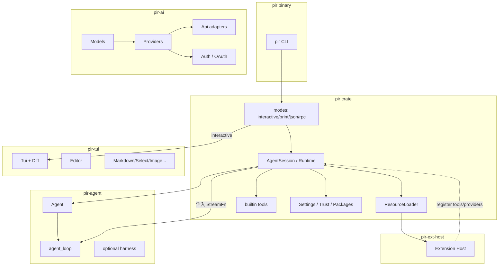
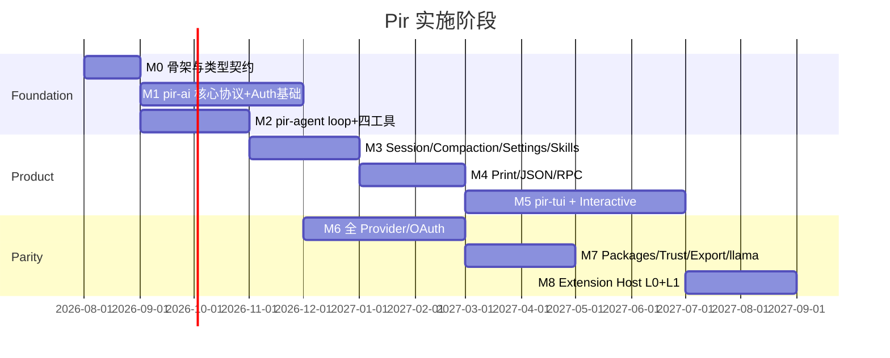

# Pir 架构设计文档

> 目标：用 Rust workspace **同构复刻** Pi agent harness。  
> 对照版本：`external/pi` @ v0.82.1  
> 配套：[`00-feasibility.md`](./00-feasibility.md)、[`01-requirements.md`](./01-requirements.md)

---

## 1. 设计原则

1. **包边界同构**：四个核心 crate 对应 Pi 四包，依赖单向。  
2. **错误进流不进 panic**：provider/stream 失败 → 事件 + `stopReason`，与 Pi 一致。  
3. **应用消息 ≠ LLM 消息**：`AgentMessage` 可扩展；仅在 `convert_to_llm` 边界收窄。  
4. **行为金标准**：`external/pi` 测试与文档；禁止「自以为合理」的语义漂移。  
5. **扩展解耦**：核心只依赖 `ExtensionHost` trait；实现为 **Rust + Wasm**（不做 JS 宿主）。见 [ADR-0001](./adr/0001-extension-and-config-dir.md)。  
6. **TUI 必达**：可并行先打通 headless/RPC 作对拍，但完整版本必须含 Interactive TUI（[ADR-0002](./adr/0002-baseline-decisions.md)）。  
7. **配置根目录**：全局 `~/.pir/agent`，项目 `.pir`（不读 `~/.pi`，不做迁移）。  
8. **上游钉死**：`external/pi` @ `2efa728` / 0.82.1（见 [`UPSTREAM.md`](../UPSTREAM.md)）。

---

## 2. Workspace 结构

```
pir/
├── Cargo.toml                 # workspace
├── crates/
│   ├── pir-ai/                # ↔ @earendil-works/pi-ai
│   ├── pir-agent/             # ↔ @earendil-works/pi-agent-core
│   ├── pir-tui/               # ↔ @earendil-works/pi-tui
│   ├── pir/                   # ↔ @earendil-works/pi-coding-agent（bin + lib SDK）
│   ├── pir-ext-host/          # Rust + Wasm 扩展宿主（无 JS）
│   └── pir-test-support/      # faux provider、黄金 JSONL、VT 助手
├── docs/
├── external/pi/               # 上游只读对照（git submodule 或 clone）
└── fixtures/                  # 从 Pi 导出的 session / RPC 样例
```

### 2.1 依赖图



---

## 3. `pir-ai` 设计

### 3.1 职责

统一多协议 LLM 访问：类型、流式事件、工具 schema 校验、用量/成本、模型目录、鉴权。

### 3.2 核心类型（镜像 Pi）

```rust
// 示意
pub enum Role { User, Assistant, ToolResult, /* app roles live in pir-agent */ }

pub struct Context {
    pub system_prompt: Option<String>,
    pub messages: Vec<Message>,
    pub tools: Vec<Tool>,
}

pub struct Model {
    pub id: String,
    pub provider: String,
    pub api: ApiKind,
    pub context_window: u32,
    // pricing, thinking, vision, ...
}

pub enum StreamEvent {
    Start { partial: AssistantMessage },
    TextStart, TextDelta { delta: String }, TextEnd,
    ThinkingStart, ThinkingDelta { delta: String }, ThinkingEnd,
    ToolCallStart { ... }, ToolCallDelta { ... }, ToolCallEnd { ... },
    Done { message: AssistantMessage },
    Error { ... },
}
```

### 3.3 Api 适配层

```
pir-ai/src/api/
  openai_completions.rs
  openai_responses.rs
  azure_openai_responses.rs
  openai_codex_responses.rs
  anthropic_messages.rs
  google_generative_ai.rs
  google_vertex.rs
  bedrock_converse_stream.rs
  mistral_conversations.rs
  pi_messages.rs
```

每个适配器实现：

```rust
#[async_trait]
pub trait ApiStream: Send + Sync {
    async fn stream(
        &self,
        model: &Model,
        ctx: &Context,
        opts: StreamOptions,
    ) -> Result<Pin<Box<dyn Stream<Item = StreamEvent> + Send>>, AiError>;
}
```

`Models::stream` / `stream_simple` 按 `model.api` 分发；thinking 在 `stream_simple` 层统一映射到各协议选项。

### 3.4 Provider 层

- `Provider`：模型列表、默认 base URL、auth 解析、可选动态 catalog
- `builtin_models()` 注册全部内置；应用可按需只注册子集（tree-shake 等价：feature flags）
- 生成/缓存的模型数据：`build.rs` 或 `pir update --models` 写入用户目录，启动只读

### 3.5 Auth

```
CredentialStore (JSON file, 0600)
  ├─ api_key entries
  └─ oauth tokens (refresh)

resolve_auth(provider, model) → headers / signer
OAuth flows: PKCE, device code, local callback page
```

OAuth 流程用 `oauth2` crate；一次性 localhost 回调页用 `axum`（已决策，见 §14）；各 provider 独立模块（anthropic、openai_codex、github_copilot、…）。

### 3.6 校验与工具

- Tool parameters：JSON Schema（从 TypeBox 语义迁移）；运行时 `jsonschema` 校验
- Partial tool-call JSON：流式累积 + 结束时校验（对齐 Pi）

---

## 4. `pir-agent` 设计

### 4.1 分层

| 模块 | 对应 Pi | 说明 |
|------|---------|------|
| `agent_loop` | `agent-loop.ts` | 无状态循环，emit 事件 |
| `agent` | `agent.ts` | 状态、订阅屏障、队列、互斥 run |
| `types` | `types.ts` | AgentEvent / AgentTool / AgentMessage |
| `harness` | `harness/*` | 可选：session 后端、skills 摘要、默认工具（coding-agent 也可自管工具） |

**建议**：coding-agent 侧已有完整 SessionManager 时，`pir` 直接持有 tools + session，`pir-agent` 保持精简 loop（与 Pi「agent 可独立用」一致）。Harness 可后置。

### 4.2 `agent_loop` 伪代码

```text
emit agent_start
emit turn_start (+ prompt message_start/end)
loop:
  loop until no toolCalls and no pending steering:
    inject pending messages
    assistant = stream_assistant(transform → convert_to_llm → stream_fn)
    if toolCalls:
      preflight (validate + before_tool_call)
      execute parallel|sequential
      emit tool_execution_* and toolResult messages (source order)
      emit turn_end
      if all terminate: break to agent_end
      if should_stop_after_turn: agent_end; return
      emit turn_start
    else:
      emit turn_end; break inner
  deliver follow-ups if any → continue outer
emit agent_end
```

### 4.3 并发模型（Rust）

- 运行时：`tokio`
- 事件：每个 listener 一个独立的 `tokio::sync::mpsc` channel（不用 `broadcast`——其 Lagged 语义与 Pi 的背压模型不符）；`Agent::subscribe` 对每个 listener `await`（有序屏障）
- 工具 parallel：`JoinSet` + 完成通道；结果按 toolCall 源序组装
- 取消：`CancellationToken` / `AbortSignal` 等价物贯穿 stream 与 bash

### 4.4 StreamFn 注入

```rust
pub type StreamFn = Arc<dyn Fn(Model, Context, StreamOptions) -> BoxStream<'static, StreamEvent> + Send + Sync>;
```

Agent **不**依赖具体 provider，便于测试 faux 与 proxy。

---

## 5. `pir-tui` 设计

### 5.1 为何不直接用 ratatui

Pi 的交互契约建立在「ANSI 行列表 + 自定义差分 + Overlay + Kitty 输入」上。ratatui 的 widget/layout 模型不同，强行适配会导致行为无法 1:1。  
**策略**：移植 pi-tui 算法；仅用 `crossterm`（或纯 termios）做 raw mode / 读写。

### 5.2 核心抽象

```rust
pub trait Component: Send {
    fn render(&self, width: usize) -> Vec<String>; // ANSI 行
}

pub trait Focusable: Component {
    fn handle_input(&mut self, raw: &str);
    fn focused(&self) -> bool;
}

pub struct Tui { /* children, overlays, focus, previous_lines, terminal */ }
```

### 5.3 渲染

1. CSI 2026 包裹  
2. 首次全量 / 尺寸变化强制清屏全量 / 否则行差分  
3. 节流 16ms  
4. 行尾 SGR + OSC 8 reset  
5. Kitty 图像行范围 expand + delete

### 5.4 输入

`StdinBuffer` → 键位解析（Kitty flags=7 + legacy）→ 全局 listener → focused component。

`KeybindingsManager` 读 JSON，映射到 editor/action 枚举（与 Pi token 名一致，便于配置互通）。

### 5.5 组件移植优先级

1. Terminal / Tui / Text / Container / Spacer  
2. SelectList / Input / Editor（可先无 autocomplete）  
3. Markdown / Loader / Box  
4. Autocomplete / Image / SettingsList  
5. Utils：grapheme 宽度（`unicode-width` + ANSI 感知包装）

---

## 6. `pir`（coding-agent）设计

### 6.1 启动管线

```text
parse args (clap)
  → resolve agent_dir / cwd / offline
  → SettingsManager (global)
  → project trust gate（interactive 可停）
  → create_agent_session_services(cwd)
       ResourceLoader: context, skills, prompts, themes, extensions
       ModelRuntime
       Tools
  → SessionManager (file | memory | resume/fork)
  → create_agent_session_from_services
  → bind extension host
  → dispatch mode: interactive | print | json | rpc
```

与 Pi `main.ts` / `createAgentSessionRuntime` 对齐，保证 `/new`、切 cwd、resume 时 **重建 cwd 绑定服务**。

### 6.2 `AgentSession`

职责聚合：

- 持有 `Agent`、当前 model、thinking level、messages 视图
- `prompt` / `steer` / `follow_up` / `abort`
- compaction / `navigate_tree`
- 把 AgentEvent 映射为 `AgentSessionEvent`（供 UI/RPC/JSON）
- 持久化：每次 message_end / tool / model_change 等 append JSONL

### 6.3 `SessionManager`

- 树：`id`（8 hex）、`parentId`、leaf 分支
- 加载迁移 v1–v3
- `build_context_messages()`：应用 compaction / branch_summary 的 retainedTail 规则
- 文件锁：`fs2` 或等价（对齐 `proper-lockfile` 意图）

**存储**：仅 JSONL。路径默认 `~/.pir/agent/sessions/`。格式对齐钉死版 Pi；**不做** `~/.pi` 迁移工具。

### 6.4 Compaction

独立模块移植 `compaction.ts` / `branch-summarization.ts` / `utils.ts`：

- token 估算：逐字节移植 Pi `estimateTokens`（`compaction.ts` 中的 chars/4 纯函数启发式；Pi 不使用 tiktoken），与 ADR-0002 §4 一致，不允许偏差
- 切点搜索、split turn、summary prompt 模板字节级对齐（便于对拍）

### 6.5 工具模块

```
pir/src/tools/
  read.rs write.rs edit.rs edit_diff.rs bash.rs
  grep.rs find.rs ls.rs
  truncate.rs file_mutation_queue.rs path_utils.rs
```

通过 `ToolContext { cwd, signal, on_update, session_env }` 注入；bash `spawn_hook` 供扩展/沙箱改道。

### 6.6 Modes

| Mode | 实现要点 |
|------|----------|
| print | 订阅事件，收集最后 assistant 文本；处理 stdin 合并 |
| json | 逐条序列化 session events |
| rpc | 命令分发器 + 严格 `\n` 帧；UI 请求/响应状态机 |
| interactive | 组件树绑定 session 事件；选择器与 slash 路由 |

RPC 与 Interactive 共享 `AgentSessionRuntime` 方法，避免两套会话逻辑。

### 6.7 ResourceLoader

统一发现：

```text
global ~/.pir/agent + project .pir + settings paths + CLI flags + packages
```

输出：`LoadedResources { extensions, skills, prompts, themes, context_files, diagnostics }`。

Skills → system prompt XML 注入；Prompt templates → slash 展开器。

---

## 7. 扩展宿主设计

### 7.1 Host 接口（核心只依赖这个）

```rust
#[async_trait]
pub trait ExtensionHost: Send + Sync {
    async fn load(&mut self, paths: &[PathBuf]) -> Result<Vec<ExtensionId>>;
    async fn reload(&mut self) -> Result<()>;
    fn as_api(&self) -> &dyn ExtensionApi; // 注册表视图
}

pub trait ExtensionApi: Send + Sync {
    fn register_tool(&self, tool: Box<dyn DynAgentTool>);
    fn register_command(&self, name: &str, cmd: CommandHandler);
    // ... 其余与 ExtensionAPI 同构
    fn emit(&self, event: ExtensionEvent) -> ExtensionEventOutcome;
}
```

`pir` 在 tool_call / session_* 等点调用 `emit`，合并 block/transform 结果。

### 7.2 后端（已决策：仅 L0 + L1）

**`NativeExtensionHost`（L0）**

- 内置扩展用 Rust 编写（llama.cpp UI、示例 permission gate）
- 动态库插件（`abi_stable`，已决策，见 §14）

**`WasmExtensionHost`（L1）**

- Wasm 插件 + host ABI，能力面与 L0 对齐
- 用于沙箱感更强、跨平台分发的第三方扩展

**明确不做**：`JsExtensionHost`、Node sidecar、jiti/TS 扩展加载。

**安装（列入计划，ADR-0002）**：本地路径 + 可分发 Wasm 包；`install`/`remove`/`list`/`update`/`config`；落盘 `~/.pir/agent/` 或 `.pir/`。声明式 skills/prompts/themes 包布局对齐 Pi。

扩展作者：按 ExtensionAPI 用 Rust/Wasm 重写；提供示例与 ABI 文档。Wasm **runtime 打进主二进制**。

### 7.3 UI 桥

```text
Extension ui.* 
  → UiBridge trait
       InteractiveUiBridge  (真 TUI)
       RpcUiBridge          (JSON 往返)
       NullUiBridge         (print/json)
```

---

## 8. 配置与路径

```rust
pub struct PirConfig {
    pub app_name: String,          // "pir"
    pub config_dir_name: String,   // ".pir"
    pub env_prefix: String,        // "PIR"
}
// agent_dir = ~/.pir/agent
// project_dir = <cwd>/.pir
```

路径解析单一模块（对齐 Pi `config.ts`），禁止各处拼 `__dirname`。

---

## 9. 错误处理与日志

- 库：`thiserror`；边界：`anyhow`（bin）
- 结构化 tracing（`tracing` + 可选 JSON）
- `/debug`：环形缓冲最近渲染行 + 最近 LLM context 快照
- Provider payload debug：对齐 Pi 的调试开关

---

## 10. 测试与对拍策略

### 10.1 金字塔

1. **纯逻辑单测**：loop 事件序、工具排序、session 树、compaction 切点  
2. **契约测**：RPC 命令/响应、session JSONL schema  
3. **黄金文件**：从 Pi 跑出的 fixtures diff（忽略 timestamp/id）  
4. **Faux provider**：确定性 tool-call 脚本  
5. **可选 live**：`PIR_LIVE_TEST=1` + API keys  

### 10.2 对拍流程（M0 交付）

**Fixtures 生成（runbook，可重复）**：

1. 在 `external/pi`（钉死 commit）上用 faux provider + 固定 prompt 脚本，分别以 `--mode json` 与 `--mode rpc` 跑标准场景（单轮问答、read/bash 工具调用、compaction 触发、steering / follow-up）。
2. 导出 session JSONL 与 RPC transcript 到 `fixtures/`。
3. 归一化：剥离 timestamp / uuid / session id / cwd，其余字节保留。

**对拍执行（CI）**：

4. `pir` 以相同场景跑 print / json / rpc，输出经同一归一化后与 fixtures diff。
5. 事件类型序列、工具调用序列、session JSONL 结构必须一致；归一化与 diff 脚本归属 `pir-test-support`。

**测试意图移植**：`external/pi` 中相关 vitest 用例的意图移植为同名 Rust 测试。

### 10.3 TUI

`VirtualTerminal` 记录输出帧；对比关键 ANSI 序列子集（去 CSI 2026 抖动）；组件级渲染快照黄金文件（Editor / SelectList / Markdown / SettingsList 等）。真机矩阵仅 smoke，进 CI nightly。

---

## 11. 实施路线图



**口径说明**：甘特为日历月。M0 含对拍 harness 与 Wasm ABI spike，1 日历月 ≈ 1–1.5 人月；M5（TUI）按 2–3 人并行计，4 日历月 ≈ 8–12 人月，与可行性文档的 8–11 人月估算一致。

**并行建议**：M1∥M2；M3–M4 与 M5（TUI）尽早重叠——**TUI 为硬性交付**，不可压到最后才开始；M6∥M3–M5；M8 含扩展**安装**而不只是 ABI。

### 里程碑交付物

| 里程碑 | 可演示结果 |
|--------|------------|
| M0 | workspace 编译；faux stream；事件枚举锁定；上游 commit 校验；对拍 harness（fixtures 生成 + 归一化 diff）；Wasm ABI spike（wasmtime 宿主 + `registerTool` + 一个 dialog 往返）并实测二进制体积 |
| M1–M2 | `pir -p` 调 Anthropic/OpenAI 完成 read/bash 任务 |
| M3–M4 | JSONL session 续跑；RPC；token 估算对拍 |
| M5 | **Interactive TUI** 可用（必达） |
| M6–M7 | Provider/OAuth；可配置产品 endpoint；单文件发布 |
| M8 | Rust/Wasm 宿主 + **扩展安装/管理** + 示例；宣布 parity（扩展语言除外） |

### 11.3 上游跟踪流程

- **频率**：每月一次，评审上游相对钉死 commit 的 CHANGELOG / diff。
- **产出**：影响面清单（按 协议 / session 格式 / 扩展 API / TUI 行为 四类标注），决定是否立项跟进。
- **升级 pin**：须新开 ADR 并重新对拍（ADR-0002 §1）；不追热点，安全修复与协议破坏级变更优先。

---

## 12. 关键模块映射表

| Pi 路径 | Pir 路径 |
|---------|----------|
| `packages/ai/src/api/*` | `crates/pir-ai/src/api/*` |
| `packages/ai/src/providers/*` | `crates/pir-ai/src/providers/*` |
| `packages/ai/src/auth/*` | `crates/pir-ai/src/auth/*` |
| `packages/agent/src/agent-loop.ts` | `crates/pir-agent/src/agent_loop.rs` |
| `packages/agent/src/agent.ts` | `crates/pir-agent/src/agent.rs` |
| `packages/tui/src/tui.ts` | `crates/pir-tui/src/tui.rs` |
| `packages/tui/src/keys.ts` | `crates/pir-tui/src/keys.rs` |
| `packages/tui/src/components/editor.ts` | `crates/pir-tui/src/components/editor.rs` |
| `packages/coding-agent/src/core/session-manager.ts` | `crates/pir/src/core/session_manager.rs` |
| `packages/coding-agent/src/core/agent-session*.ts` | `crates/pir/src/core/agent_session*.rs` |
| `packages/coding-agent/src/core/compaction/*` | `crates/pir/src/core/compaction/*` |
| `packages/coding-agent/src/core/extensions/*` | `crates/pir/src/core/extensions/*` + `pir-ext-host` |
| `packages/coding-agent/src/core/tools/*` | `crates/pir/src/tools/*` |
| `packages/coding-agent/src/modes/*` | `crates/pir/src/modes/*` |
| `packages/coding-agent/src/cli/*` | `crates/pir/src/cli/*` |

---

## 13. 已决策与剩余开放项

### 已决策

- [ADR-0001](./adr/0001-extension-and-config-dir.md)：扩展 = Rust/Wasm；配置 = `~/.pir`
- [ADR-0002](./adr/0002-baseline-decisions.md)：上游钉死 `2efa728` / 0.82.1；扩展安装列入计划；TUI 必达；token 与 Pi 一致；单文件 + Wasm 打进主包；无 session 路径迁移；仅 JSONL；可配置自有 endpoint；MIT

### 剩余开放项

当前无阻塞开工的开放项。实现期细节（Wasm ABI 字节布局、扩展包 manifest 字段等）在模块设计中细化。

2026-07-28 选型收口（见 §14）：Bedrock 接入方式、OAuth 本地回调、动态库插件 ABI、Agent 事件通道、工具并行原语均已定案；剩余开放项收敛为 **Wasm ABI 字节布局**与**扩展包 manifest 字段**两项，待 M0 spike 实测后定。

---

## 14. 附录：技术选型速查

| 领域 | 选型 |
|------|------|
| Async | tokio |
| HTTP | reqwest (**rustls**，服务单文件) |
| CLI | clap |
| JSON | serde / serde_json |
| YAML frontmatter | serde_yaml |
| Schema | jsonschema |
| Diff / edit | 移植 Pi `edit-diff` 语义 |
| Glob / ignore | globset / ignore |
| Session 存储 | **仅 JSONL**（第一版不做 SQLite） |
| TUI I/O | crossterm |
| Unicode 宽度 | unicode-width / unicode-segmentation |
| Tracing | tracing |
| OAuth | 自研模块 + oauth2 crate |
| OAuth 本地回调 | axum（一次性 localhost 服务，tokio 原生；不引 tiny_http） |
| Bedrock 接入 | 手写 SigV4 + reqwest + 自实现 event-stream 解码（不引 aws-sdk，控制依赖面与单文件体积） |
| Agent 事件通道 | 每 listener 独立 tokio mpsc（不用 broadcast，背压语义对齐 Pi） |
| 工具并行执行 | JoinSet + 完成通道（结果按 toolCall 源序组装） |
| 动态库插件 ABI | abi_stable（L0 Rust 插件；不手写 C ABI） |
| Wasm 扩展 | **wasmtime 嵌入主二进制** + host ABI |
| Token 估算 | **与钉死版 Pi 同一算法** |
| 产品 Endpoint | settings / env 可配置（更新检查、telemetry） |
| 许可证 | **MIT** |
| TS 嵌入 | **不做** |

---

**设计收束**：Pir 按钉死版 Pi 的包边界与事件契约做同构移植；扩展为 Rust/Wasm（含安装计划）；TUI 必达。见 ADR-0001 / ADR-0002。
